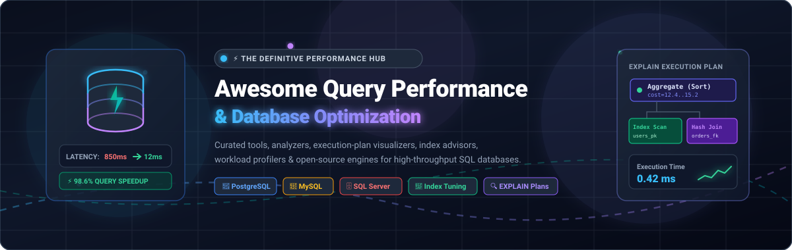

<p align="center">
  
</p>

# ⚡ Awesome Query Performance & Database Optimization

<p align="left">
  <a href="https://github.com/ishandutta2007/Awesome-Awesome-Awesome"></a>
  <a href="https://discord.gg/jc4xtF58Ve"></a>
  <a href="https://github.com/ishandutta2007/Awesome-Query-Performance-Optimization/stargazers"></a>
  <a href="https://github.com/ishandutta2007/Awesome-Query-Performance-Optimization/network/members"></a>
  <a href="https://github.com/ishandutta2007/Awesome-Query-Performance-Optimization/blob/main/LICENSE"></a>
  <a href="https://github.com/ishandutta2007/Awesome-Query-Performance-Optimization/pulls"></a>
  <a href="https://github.com/ishandutta2007"></a>
</p>

---

> 🚀 **The definitive, curated ecosystem of database performance monitoring, SQL query optimization platforms, execution-plan visualizers, index advisors, workload profilers, and tuning tools.**
> 
> *Targeted at Database Administrators (DBAs), Site Reliability Engineers (SREs), Platform Architects, and Backend Engineers operating high-throughput transactional and analytical database workloads.*

---

## 📑 Table of Contents

- [🌟 Market Overview & Sector Dynamics](#-market-overview--sector-dynamics)
- [☁️ SaaS & Hosted Platforms](#️-saas--hosted-platforms)
- [💻 Open-Source GitHub Projects](#-open-source-github-projects)
- [🏗️ Self-Hosted Modular Optimization Architecture](#️-self-hosted-modular-optimization-architecture)
- [🔬 Core Query Optimization Pillars](#-core-query-optimization-pillars)
- [⭐ Star History](#-star-history)
- [🤝 How to Contribute](#-how-to-contribute)
- [⚖️ Disclaimer & License](#️-disclaimer--license)

---

## 🌟 Market Overview & Sector Dynamics

> 📊 **Market Overview & Industry Structure:** The global **Database Performance Monitoring & Query Optimization** market is estimated at **$2.5B – $4.0B+** (projected to grow at ~11–13% CAGR through 2030). The sector is **moderately fragmented**: enterprise observability conglomerates (such as Datadog and SolarWinds) provide multi-tier infrastructure and APM integration, while specialized, deep SQL diagnostic and execution-plan optimization platforms (such as pganalyze, EverSQL, pgMustard, and Postgres.ai) cater to deep database tuning, query plan analysis, and automated index advisory.

---

## ☁️ SaaS & Hosted Platforms

*The following table tracks notable commercial and hosted platforms for SQL query optimization, database health monitoring, wait-time analysis, and index tuning. Sorted by **Company Scale / Valuation / Revenue** in descending order.*

| Product | Core Capabilities | Supported Databases | Pricing (Starting Tier) | Free Tier & Trial Limits | Company Scale / Valuation / Revenue |
| :--- | :--- | :--- | :--- | :--- | :--- |
| **[Datadog Database Monitoring](https://www.datadoghq.com/product/database-monitoring/)** 🐕 | Enterprise database observability, query metrics, execution plans, deadlock tracking, and APM telemetry correlation. | PostgreSQL, MySQL, SQL Server, Oracle, Aurora | Starts at **$70 / database host / month** (Annual) or **$84 / host / month** (On-demand) | **14-day free trial** (Full platform access including DBM, APM, and host metrics; no permanent free tier) | **~$40B+ Market Cap** / ~$2.6B+ ARR (Public: NASDAQ: `DDOG`) |
| **[EverSQL (by Aiven)](https://www.eversql.com)** ⚡ | AI-driven SQL query optimizer and indexing recommendations for automatic query rewriting and slow-query tuning. | PostgreSQL, MySQL, MariaDB | **$0** (Free standalone web query optimizer); continuous monitoring starts at **$29 / month** (Aiven platform tiers) | **Free-forever plan** (Unlimited single-query optimizations via web tool) and **14-day free trial** on cloud platform | **~$3B Valuation** (Series D) / ~$100M+ ARR (Acquired by Aiven) |
| **[SolarWinds Database Performance Analyzer (DPA)](https://www.solarwinds.com/database-performance-analyzer)** 📊 | Multi-database wait-time analysis, SQL bottleneck identification, blocking/deadlock diagnostics, and anomaly detection. | SQL Server, Oracle, PostgreSQL, MySQL, DB2, SAP ASE | Starts at **$1,699 per database instance** (Perpetual license with 1st yr maintenance) or **$840 / instance / year** (Subscription) | **14-day free trial** (Fully functional across all supported database engines without instance limits) | **~$2.0B Market Cap** / ~$780M+ ARR (Public: NYSE: `SWI`) |
| **[SolarWinds SQL Sentry](https://www.solarwinds.com/sql-sentry)** 🛡️ | SQL Server workload profiling, execution plan analysis, tempdb monitoring, deadlock diagnostics, and automated tuning. | SQL Server, Azure SQL | Starts at **$1,233 / target instance / year** (Subscription) or perpetual license starting at **$2,495 / instance** | **14-day free trial** (Fully functional monitoring and diagnostics for SQL Server and cloud database targets) | **~$2.0B Market Cap** / ~$780M+ ARR (Public: NYSE: `SWI`) |
| **[Redgate SQL Monitor](https://www.red-gate.com/products/dba/sql-monitor/)** 🚦 | Fleet-wide SQL Server health monitoring, blocking and deadlock analysis, slow query tracking, and execution plan diagnostics. | SQL Server, Azure SQL | Starts at **$1,233 / server / year** (Standard tier for 1–4 servers; volume discounts starting at 5+ servers) | **14-day free trial** (Full enterprise monitoring feature set across on-premise, virtual machines, and cloud instances) | **~$600M – $800M Est. Valuation** / ~$100M+ ARR (Private) |
| **[Devart dbForge Studio / Monitor](https://www.devart.com/dbforge/)** 🛠️ | Database IDE and performance monitoring tooling with query profiling, execution plan inspection, and server health tracking. | SQL Server, MySQL, MariaDB, PostgreSQL, Oracle | **$0** (dbForge Monitor add-in for SSMS); dbForge Studio Standard starts at **$119.40 / user / year** (MySQL) or **$229.95 / user / year** (SQL Server) | **30-day free trial** (Enterprise features) which reverts to **free-forever Express Edition** (Basic query editing and management); SSMS Monitor add-in is free forever | **~$20M – $30M ARR** (Private) |
| **[ClusterControl (Severalnines)](https://severalnines.com/clustercontrol/)** ☸️ | Multi-database operations, topology deployment, automated failover, query performance monitoring, and backup automation. | MySQL, MariaDB, PostgreSQL, MongoDB, Redis | **€0** (Community Edition); Advanced tier starts at **€250 / node / month** (or **€0.35 / node / hour**) | **Free-forever Community Edition** (Core deployment, monitoring, and replication management) + **30-day free trial** of Enterprise features | **~$10M – $20M ARR** (Private) |
| **[pganalyze](https://pganalyze.com)** 📈 | PostgreSQL performance monitoring, execution plan analysis, Index Advisor, VACUUM Advisor, and query troubleshooting. | PostgreSQL | Starts at **$149 / month** (Production plan for 1 server, 14 days history; Scale plan at $399/month for up to 4 servers) | **14-day free trial** (Full access, unlimited users, no credit card required; no permanent free tier) | **~$20M – $35M Est. Valuation** / ~$3M–$5M ARR (VC-backed) |
| **[Postgres.ai](https://postgres.ai)** 🤖 | PostgreSQL development and performance platform with Database Lab Engine (thin database branching/cloning) and automated AI checkups. | PostgreSQL | **$0 / month** (Hobby plan); Express plan starts at **$16 / cluster / month**; DBLab Standard from **$62 / month** | **Free-forever Hobby plan** (Includes weekly AI-assisted database checkup reports for personal/pet projects) | **~$15M – $25M Est. Valuation** (Y Combinator W20 / Seed) |
| **[pgMustard](https://www.pgmustard.com)** 🔍 | Visual execution plan analysis for PostgreSQL `EXPLAIN (ANALYZE, BUFFERS)` output with performance tips and bottleneck scoring. | PostgreSQL | Starts at **€95 / year** (~$100/yr for Pro single user; €500/year for Team up to 20 users) | **Free trial: 5 query plan reviews** (Includes all tips and visual plan tree inspection; no credit card required) | **~$500K – $1M ARR** (Bootstrapped / Indie) |
| **[Releem](https://releem.com)** ⚙️ | Automated database configuration tuning, query analytics, and index recommendations via lightweight agent and cloud console. | MySQL, MariaDB, PostgreSQL | Starts at **$11 / server / month** (Hosting plan) or **$25 / server / month** (Advanced plan with query analytics) | **14-day free trial** (Full feature set) and **Free plan** (Basic configuration recommendations for up to 1 server) | **<$1M ARR** (Angel / Seed) |

---

## 💻 Open-Source GitHub Projects

*Curated open-source query optimization engines, profilers, analyzers, extensions, and diagnostic utilities. Sorted by **GitHub Star Count** in descending order.*

1. **[Grafana](https://github.com/grafana/grafana)** [](https://github.com/grafana/grafana/stargazers) 📈  
   The open and composable observability and data visualization platform. Widely used to visualize slow query logs, query latency distributions, cache hit rates, connection pool exhaustion, and database throughput.

2. **[Prometheus](https://github.com/prometheus/prometheus)** [](https://github.com/prometheus/prometheus/stargazers) 🔥  
   The de-facto open-source monitoring system and time-series database. Forms the metrics collection backbone for PostgreSQL, MySQL, and cloud database performance instrumentation.

3. **[PostgreSQL Core](https://github.com/postgres/postgres)** [](https://github.com/postgres/postgres/stargazers) 🐘  
   The world's most advanced open-source relational database. Features native query optimizer architecture, cost-based planner, execution engine, `EXPLAIN (ANALYZE, BUFFERS)`, `auto_explain`, JIT compilation, and internal statistics infrastructure (`pg_stat_statements`).

4. **[Vitess](https://github.com/vitessio/vitess)** [](https://github.com/vitessio/vitess/stargazers) 🚀  
   Database clustering system for horizontal scaling and query optimization for MySQL. Includes intelligent query rewriting, connection pooling, automated query routing, and sharding.

5. **[gh-ost](https://github.com/github/gh-ost)** [](https://github.com/github/gh-ost/stargazers) 👻  
   GitHub's triggerless online schema migration tool for MySQL. Prevents lock contention and eliminates query latency spikes during large schema and index changes.

6. **[MySQL Server](https://github.com/mysql/mysql-server)** [](https://github.com/mysql/mysql-server/stargazers) 🐬  
   The world's most popular open-source relational database engine. Packed with Performance Schema, `EXPLAIN FORMAT=JSON` optimizer traces, Cost Model configuration, and Query Rewrite plugins.

7. **[usql](https://github.com/xo/usql)** [](https://github.com/xo/usql/stargazers) 💻  
   Universal command-line interface for SQL databases with native support for query timing, execution plan inspection, and cross-database profiling (PostgreSQL, MySQL, SQLite, Oracle, SQL Server).

8. **[pgweb](https://github.com/sosedoff/pgweb)** [](https://github.com/sosedoff/pgweb/stargazers) 🌐  
   Lightweight, web-based PostgreSQL browser and query runner written in Go with query timing and visual execution inspection.

9. **[MariaDB Server](https://github.com/MariaDB/server)** [](https://github.com/MariaDB/server/stargazers) 🦭  
   Fast, scalable community-developed open-source database engine featuring optimizer tracing, query performance profiling, InnoDB thread tuning, and Spider distributed engine.

10. **[kingshard](https://github.com/flike/kingshard)** [](https://github.com/flike/kingshard/stargazers) 👑  
    High-performance MySQL proxy written in Go supporting SQL parsing, query caching, connection pooling, and read/write splitting to prevent backend database overload.

11. **[Postgres Operator (Zalando)](https://github.com/zalando/postgres-operator)** [](https://github.com/zalando/postgres-operator/stargazers) ☸️  
    Production-grade Kubernetes operator for scalable PostgreSQL clusters with automated connection pooling (PgBouncer), replication monitoring, and failover optimization.

12. **[pgBadger](https://github.com/darold/pgbadger)** [](https://github.com/darold/pgbadger/stargazers) 🦡  
    High-speed PostgreSQL log analyzer written in Perl. Parses multi-gigabyte log files to generate comprehensive HTML charts showing slowest queries, temporary file usage, checkpoint spikes, and lock conflicts.

13. **[DBML](https://github.com/holistics/dbml)** [](https://github.com/holistics/dbml/stargazers) 📐  
    Database Markup Language (DBML) designed to define, model, and document relational schemas, foreign keys, and indexes for optimized query design.

14. **[postgres_exporter](https://github.com/prometheus-community/postgres_exporter)** [](https://github.com/prometheus-community/postgres_exporter/stargazers) 📦  
    Prometheus metrics exporter for PostgreSQL databases. Collects critical query execution metrics, lock counts, table/index bloat, and `pg_stat_statements` telemetry.

15. **[sqldef](https://github.com/sqldef/sqldef)** [](https://github.com/sqldef/sqldef/stargazers) 🔄  
    Idempotent schema management tool for MySQL, PostgreSQL, SQLite, and SQL Server that applies schema and index modifications safely and declaratively.

16. **[pg_activity](https://github.com/dalibo/pg_activity)** [](https://github.com/dalibo/pg_activity/stargazers) ⚡  
    Real-time interactive top-like terminal utility for inspecting PostgreSQL server activity, running queries, blocking locks, CPU/memory, and I/O consumption per backend process.

17. **[sqlcheck](https://github.com/jarulraj/sqlcheck)** [](https://github.com/jarulraj/sqlcheck/stargazers) 🔍  
    Automated SQL static code analyzer that detects anti-patterns (such as wildcard selects, missing join predicates, non-sargable queries, and Cartesian products) to prevent query degradation before deployment.

18. **[pg_repack](https://github.com/reorg/pg_repack)** [](https://github.com/reorg/pg_repack/stargazers) 📦  
    PostgreSQL extension that reorganizes bloated tables and indexes online without acquiring exclusive table locks, maintaining query throughput during maintenance.

19. **[pgFormatter](https://github.com/darold/pgFormatter)** [](https://github.com/darold/pgFormatter/stargazers) ✨  
    Fast SQL and PL/pgSQL beautifier and query formatter that standardizes SQL readability, accelerating query plan reviews and query refactoring.

20. **[HypoPG](https://github.com/HypoPG/hypopg)** [](https://github.com/HypoPG/hypopg/stargazers) 🧪  
    Hypothetical index extension for PostgreSQL. Lets engineers evaluate whether the query planner would pick a proposed index before spending disk I/O and time creating it physically.

21. **[Percona Toolkit](https://github.com/percona/percona-toolkit)** [](https://github.com/percona/percona-toolkit/stargazers) 🧰  
    Battle-tested collection of advanced command-line tools for MySQL, Percona Server, and PostgreSQL (includes `pt-query-digest`, `pt-online-schema-change`, `pt-index-usage`, and `pt-visual-explain`).

22. **[Anemometer](https://github.com/box/Anemometer)** [](https://github.com/box/Anemometer/stargazers) 💨  
    MySQL slow-query monitor and visual analytics dashboard created by Box. Parses `pt-query-digest` outputs to surface query regressions and workload shifts over time.

23. **[Percona Server for MySQL](https://github.com/percona/percona-server)** [](https://github.com/percona/percona-server/stargazers) 🏎️  
    Enterprise-grade, drop-in MySQL replacement featuring enhanced diagnostic counters, extended slow query logs, memory engines, and RocksDB integration for high-throughput transactional loads.

24. **[pgmetrics](https://github.com/rapidloop/pgmetrics)** [](https://github.com/rapidloop/pgmetrics/stargazers) 📊  
    Zero-dependency CLI tool to extract and display over 400 performance metrics, vacuum statistics, query execution counters, and lock diagnostics from running PostgreSQL instances.

25. **[Percona Monitoring and Management (PMM)](https://github.com/percona/pmm)** [](https://github.com/percona/pmm/stargazers) 🖥️  
    Open-source database observability platform with deep query analytics (`Query Analytics / QAN`), workload metrics, and advisory checks for MySQL, PostgreSQL, and MongoDB.

26. **[pg_hint_plan](https://github.com/ossc-db/pg_hint_plan)** [](https://github.com/ossc-db/pg_hint_plan/stargazers) 🎯  
    PostgreSQL extension that lets developers and DBAs use optimizer hints inside SQL comments (`/*+ SeqScan(t1) IndexScan(t2) */`) for controlled query plan benchmarking and emergency plan fixes.

27. **[PoWA](https://github.com/powa-team/powa)** [](https://github.com/powa-team/powa/stargazers) 🔎  
    PostgreSQL Workload Analyzer providing a self-hosted historical query performance dashboard aggregating stats from `pg_stat_statements`, `pg_qualstats`, `pg_stat_kcache`, and wait events.

28. **[pg_squeeze](https://github.com/cybertec-postgresql/pg_squeeze)** [](https://github.com/cybertec-postgresql/pg_squeeze/stargazers) 🗜️  
    PostgreSQL extension that automatically removes table bloat in the background without locking tables, keeping disk I/O and query scans efficient.

29. **[pg_stat_monitor](https://github.com/percona/pg_stat_monitor)** [](https://github.com/percona/pg_stat_monitor/stargazers) ⏱️  
    Advanced PostgreSQL query monitoring extension by Percona that adds time-bucketed aggregation, multidimensional histograms, execution plans, and table-access statistics.

30. **[pg_qualstats](https://github.com/powa-team/pg_qualstats)** [](https://github.com/powa-team/pg_qualstats/stargazers) 🏷️  
    PostgreSQL extension that records statistics on WHERE clauses and join predicates, helping identify missing composite indexes and predicate skew.

31. **[Releem Agent](https://github.com/Releem/releem-agent)** [](https://github.com/Releem/releem-agent/stargazers) 🤖  
    Lightweight open-source database advisor agent for MySQL, MariaDB, and PostgreSQL that analyzes system metrics and server configurations to suggest optimal settings.

32. **[pg_stat_kcache](https://github.com/powa-team/pg_stat_kcache)** [](https://github.com/powa-team/pg_stat_kcache/stargazers) 💾  
    PostgreSQL extension gathering kernel-level physical disk reads/writes, user/system CPU times, and page faults correlated to individual SQL statements.

33. **[pg_wait_sampling](https://github.com/postgrespro/pg_wait_sampling)** [](https://github.com/postgrespro/pg_wait_sampling/stargazers) ⏳  
    Sampling-based PostgreSQL extension providing detailed wait-event histograms and profile data to identify lock, I/O, IPC, and buffer contention.

---

## 🏗️ Self-Hosted Modular Optimization Architecture

A robust self-hosted database query optimization stack can be assembled using modular open-source components:

```
┌─────────────────┐     ┌──────────────────────┐     ┌────────────────────────┐
│  SQL Statements │ ──> │ Query Normalization  │ ──> │ Execution Plan Engine  │
│  & Transactions │     │ (pg_stat_statements) │     │ (EXPLAIN / HypoPG)     │
└─────────────────┘     └──────────────────────┘     └────────────────────────┘
                                                                 │
                                                                 ▼
┌─────────────────┐     ┌──────────────────────┐     ┌────────────────────────┐
│ Grafana Alerts  │ <── │ Prometheus Exporter  │ <── │ Workload Aggregation   │
│ & Dashboards    │     │ (postgres_exporter)  │     │ (PoWA / pg_stat_mon)   │
└─────────────────┘     └──────────────────────┘     └────────────────────────┘
```

### 🧩 Recommended Self-Hosted PostgreSQL Stack

| Layer | Recommended Open-Source Tools | Purpose |
| :--- | :--- | :--- |
| **Telemetry & Metrics** | `pg_stat_statements` + `pg_stat_monitor` | Normalized query stats, execution counts, latency percentiles |
| **System I/O & CPU** | `pg_stat_kcache` + `pg_wait_sampling` | OS disk I/O attribution & wait event profiling |
| **Predicate Analysis** | `pg_qualstats` + `HypoPG` | Index candidate evaluation & hypothetical query planning |
| **Log Analytics** | `pgBadger` | Automated log parsing for checkpoint spikes, slow queries, and temp files |
| **Maintenance** | `pg_repack` + `pg_squeeze` | Online table and index reorganization without blocking locks |
| **Visualization** | `Prometheus` + `Grafana` + `PoWA` | Fleet metrics storage, trend graphing, and alerting |

---

## 🔬 Core Query Optimization Pillars

- 🐢 **Slow Query Detection**: Isolate queries consuming disproportionate CPU, shared buffers, or execution time.
- 🧬 **Query Fingerprinting**: Normalize queries to group similar parameter executions and track aggregate latency.
- 🌳 **Execution Plan Inspection**: Analyze scan types (Sequential vs. Index/Bitmap Scan), join algorithms (Hash vs. Merge vs. Nested Loop), and cost estimates.
- 📉 **Plan Regression Prevention**: Detect plan alterations caused by data volume growth, stale statistics, or schema modifications.
- 🎯 **Index Optimization**: Identify unused, duplicate, or missing compound indexes to reduce I/O.
- 🧱 **Bloat & VACUUM Management**: Monitor dead tuples and autovacuum performance to prevent table degradation.
- 🧪 **Hypothetical Index Verification**: Test potential indexing improvements without building physical indexes.
- 🚦 **Lock & Wait Event Analysis**: Detect transaction lock queues, row lock contention, and buffer pins.

---

## ⭐ Star History

[](https://star-history.dera.page/#ishandutta2007/Awesome-Query-Performance-Optimization&type=date&legend=top-left)

---

## 🤝 How to Contribute

We welcome contributions from the database and systems engineering community!

1. 🍴 **Fork the repository**.
2. 🌿 **Create a descriptive branch** (`git checkout -b add-awesome-tool`).
3. 📝 **Add your tool** adhering to the existing formatting (table for SaaS or star-badged item for Open-Source).
4. 🔍 **Verify links and factual details**.
5. 📬 **Submit a Pull Request** with a brief summary of the project.

---

## ⚖️ Disclaimer & License

- *This is a community-curated list and does not constitute an official endorsement.*
- *Always test query optimization suggestions and indexing modifications in a staging environment before applying them to production.*
- *Licensed under the [MIT License](LICENSE).*
